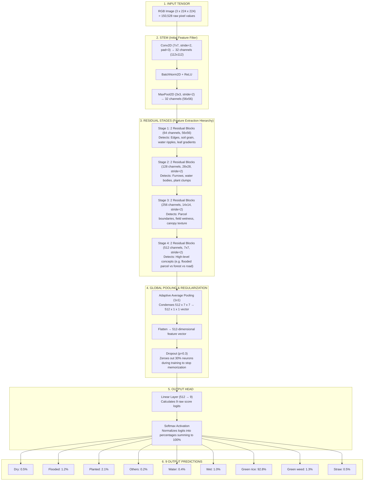

# 🧠 Neural Network Architecture: 9-Class Rice Field Classifier

> **File Reference:** [`src/model.py`](../src/model.py)  
> **Model Class:** `RiceFieldClassifier`  
> **Input:** RGB Satellite/Drone Image tensor of shape `(Batch, 3, 224, 224)`  
> **Output:** 9 Class Probabilities for `[Dry, Flooded, Planted, Others, Water, Wet, Green rice, Green weed, Straw]`

---

## 📌 Executive Summary

The Rice-Brain classifier takes a high-resolution agricultural photo (containing over **150,000 pixel values**) and condenses it through successive layers of mathematical transformations into **9 output numbers**. 

Each output number represents the probability that the given parcel of land belongs to one of nine states:
1. **Dry (🏜️)**: Harvested, bare dry soil, or fallow field.
2. **Flooded (💧)**: Standing water, mud preparations, waterlogged paddy.
3. **Planted (🌿)**: Actively growing, green vegetative rice canopy.
4. **Others (🌳)**: Trees, buildings, roads, canals, non-field terrain.
5. **Water (🌊)**: Open water bodies, irrigation reservoirs, deep water.
6. **Wet (🌧️)**: Moist/saturated soil without deep standing water.
7. **Green rice (🌾)**: Established, healthy green rice crop canopy.
8. **Green weed (🌱)**: Invasive or unwanted non-rice green vegetation/weeds.
9. **Straw (🍂)**: Post-harvest straw residue, mulch, crop stubble.



---

## 🔬 Step-by-Step Logic and Rationale

Below is the detailed breakdown of every single step in the network, explaining **what** is being computed and **why** it is necessary.

---

### Step 1: The Input Tensor
* **Code:** `x` passed to `forward(self, x)`
* **Shape:** `[Batch_Size, 3, 224, 224]`
* **What happens:**  
  The raw image is scaled to $224 \times 224$ pixels and normalized across the 3 RGB color channels using standard ImageNet mean (`[0.485, 0.456, 0.406]`) and standard deviation (`[0.229, 0.224, 0.225]`).
* **Why this is done:**  
  Neural networks cannot process raw JPEG files directly; they require normalized matrices of numbers centered around zero. Normalization prevents exploding or vanishing gradients during backpropagation and ensures color channels are evaluated uniformly.

---

### Step 2: The Stem (Rapid Spatial Reduction)
* **Code:** 
  ```python
  self.stem = nn.Sequential(
      nn.Conv2d(in_channels, 32, kernel_size=7, stride=2, padding=3, bias=False),
      nn.BatchNorm2d(32),
      nn.ReLU(inplace=True),
      nn.MaxPool2d(kernel_size=3, stride=2, padding=1)
  )
  ```
* **Output Shape:** `[Batch_Size, 32, 56, 56]`
* **What happens:**  
  1. A large $7 \times 7$ convolution slides across the image with a stride of 2, producing 32 distinct feature maps.
  2. Batch Normalization stabilizes activations across the batch.
  3. ReLU (Rectified Linear Unit) zeroes out negative values to introduce non-linearity.
  4. Max Pooling with stride 2 halves the spatial resolution once again.
* **Why this is done:**  
  Processing $224 \times 224$ pixels across dozens of deep layers is computationally heavy. The stem quickly drops the image dimension by a factor of 4 ($224 \to 112 \to 56$) while capturing fundamental visual primitives (contrast edges, color boundaries, brightness gradients).

---

### Step 3: Residual Stages 1 through 4 (Hierarchical Feature Extraction)
The network passes the features through 4 sequential stages of `ResidualBlock`s:

| Stage | Input Channels | Output Channels | Spatial Resolution | Key Features Extracted |
| :--- | :---: | :---: | :---: | :--- |
| **Stage 1** | 32 | 64 | $56 \times 56$ | Fine textures: soil roughness, water glint, leaf edges |
| **Stage 2** | 64 | 128 | $28 \times 28$ | Mid-level patterns: planting lines, muddy patches, bund walls |
| **Stage 3** | 128 | 256 | $14 \times 14$ | Large structures: parcel shape, uniform standing water, dense green canopy |
| **Stage 4** | 256 | 512 | $7 \times 7$ | High-level semantic concepts: "Rice Field" vs "Canal" vs "Road/Building" |

#### 🔑 The Logic Behind the Residual Skip Connection:
Each block computes:
$$\text{Output} = \text{ReLU}(\text{Conv2}(\text{Conv1}(x)) + x)$$

* **Why use skip connections ($+ x$)?**  
  In standard deep networks, stacking many layers causes gradients to shrink to near zero during backpropagation (the **vanishing gradient problem**).  
  By adding the identity shortcut ($+ x$), the gradient can flow directly backward through the addition operation without attenuation. This allows the network to learn rich, deep representations without degradation.

---

### Step 4: Adaptive Global Average Pooling
* **Code:** `self.avgpool = nn.AdaptiveAvgPool2d((1, 1))`
* **Shape change:** `[Batch_Size, 512, 7, 7]` $\to$ `[Batch_Size, 512, 1, 1]`
* **What happens:**  
  For each of the 512 feature channels, the average value across all $7 \times 7 = 49$ spatial positions is calculated.
* **Why this is done:**  
  * **Eliminates parameter explosion:** In older architectures like VGG, flattening $512 \times 7 \times 7 = 25,088$ features into a dense layer required millions of weights, causing massive overfitting. Global pooling reduces this to just 512 values with zero extra parameters.
  * **Spatial invariance:** It does not matter if a tree or a flooded patch is in the top-left or bottom-right corner of the image; global average pooling aggregates the evidence across the entire parcel.

---

### Step 5: Dropout Regularization
* **Code:** `self.dropout = nn.Dropout(p=0.3)`
* **What happens:**  
  During training, 30% of the 512 neuron activations are randomly set to zero on every iteration.
* **Why this is done:**  
  Prevents neurons from co-adapting (relying too much on each other or memorizing specific training images). It forces the network to learn redundant, robust features so that it generalizes accurately to unseen photos. During inference/testing, dropout is automatically disabled.

---

### Step 6: Fully Connected Linear Layer (The 9 Outputs)
* **Code:** `self.fc = nn.Linear(512, num_classes)` (where `num_classes = len(CLASSES) = 9`)
* **Shape change:** `[Batch_Size, 512]` $\to$ `[Batch_Size, 9]`
* **What happens:**  
  Each of the 9 output nodes computes a weighted sum of the 512 high-level features plus a learnable bias term:
  $$z_i = \sum_{j=1}^{512} W_{i,j} \cdot f_j + b_i \quad \text{for } i \in \{1, \dots, 9\}$$
* **Why this is done:**  
  This is the decision maker. It projects the abstract visual features into class scores (logits):
  * $z_0$: Score for **Dry**
  * $z_1$: Score for **Flooded**
  * $z_2$: Score for **Planted**
  * $z_3$: Score for **Others**
  * $z_4$: Score for **Water**
  * $z_5$: Score for **Wet**
  * $z_6$: Score for **Green rice**
  * $z_7$: Score for **Green weed**
  * $z_8$: Score for **Straw**

---

### Step 7: Softmax Function (Probabilities)
* **Code:** `probabilities = torch.softmax(logits, dim=1)` *(inside inference)*
* **Mathematical Formula:**
  $$P(\text{Class } i) = \frac{e^{z_i}}{\sum_{k=1}^{9} e^{z_k}}$$
* **What happens:**  
  Raw numbers (which can be negative or positive) are exponentiated and divided by their sum.
* **Why this is done:**  
  1. Guaranteed range between $0.0$ and $1.0$ ($0\%$ to $100\%$).
  2. All 9 probabilities sum up to exactly $1.0$ ($100\%$).
  3. Provides an interpretable **confidence score** (e.g. "92.8% confident this parcel is Green rice"). If the top probability is low (e.g., below 60%), the system or operator knows the parcel requires manual review.

---

## 📊 Summary Table

| Step | Layer Name | Input Dimensions | Output Dimensions | Core Purpose |
| :---: | :--- | :---: | :---: | :--- |
| **1** | Input Normalization | Image file | `(3, 224, 224)` | Scales pixels into standard range for stable gradient descent |
| **2** | Stem (Conv7x7 + Pool) | `(3, 224, 224)` | `(32, 56, 56)` | Quick 4x downsampling; extracts low-level edge & color cues |
| **3** | Residual Stage 1 | `(32, 56, 56)` | `(64, 56, 56)` | Captures fine surface textures (rough dirt, water ripples) |
| **4** | Residual Stage 2 | `(64, 56, 56)` | `(128, 28, 28)` | Downsamples 2x; detects mid-scale parcel features & planting lines |
| **5** | Residual Stage 3 | `(128, 28, 28)` | `(256, 14, 14)` | Downsamples 2x; recognizes field boundaries & vegetation density |
| **6** | Residual Stage 4 | `(256, 14, 14)` | `(512, 7, 7)` | Downsamples 2x; represents high-level domain concepts |
| **7** | Global Average Pooling | `(512, 7, 7)` | `(512, 1, 1)` | Flattens 2D maps into 1D vector; provides translation invariance |
| **8** | Dropout (30%) | `512` | `512` | Prevents overfitting and memorization of training photos |
| **9** | Linear Layer | `512` | `9` | Maps 512 semantic features to the 9 target class logits |
| **10** | Softmax | `9` | `9` | Converts logits into percentage confidence scores summing to 100% |
